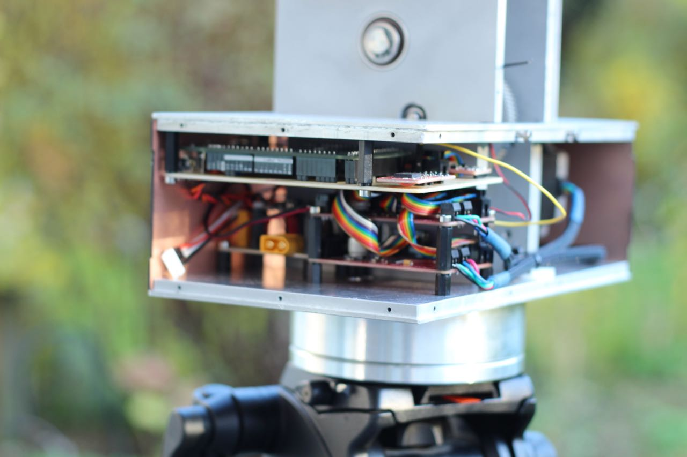

# Antenna Tracker For UAV's
This project was built within the scope of a Bachelor and Semester Thesis in Mechanical Engineering.
It's goal was the design of a UAV ground station which automatically points a directional antenna (5kg+) towards a moving drone.

#### Tasks Included:
* Mechanical Design
* Electrical Design
* Software Design
* Manufacturing
* Requirement Validation

#### CAD Animation of the Concept:
https://www.youtube.com/watch?v=weVFpQjD0uo

## Final Result
#### Overview:

